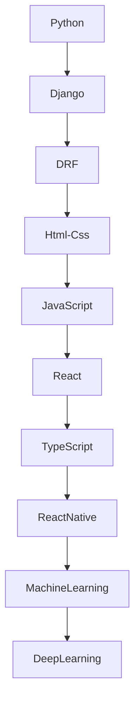

<div align="center">

# 🚀 Hey, I'm Mehrsam


<p>


</p>

</div>

---

# 👨‍💻 About Me

```python
class Mehrsam:

    def __init__(self):

        self.username = "mehrsam-codes"

        self.age = 14

        self.role = "Backend Developer"

        self.languages = [
            "Python",
            "JavaScript"
        ]

        self.backend = [
            "Django",
            "Django REST Framework",
            "PostgreSQL"
        ]

        self.learning = [
            "Advanced Django",
            "JavaScript"
        ]

        self.future = [
            "React",
            "TypeScript",
            "React Native",
            "Machine Learning",
            "Deep Learning"
        ]

    def motto(self):
        return "Build. Learn. Repeat."
```

---

# ⚡ Tech Stack

<div align="center">


</div>

---

# 🚀 Current Mission

```text
✔ Building REST APIs

✔ Clean Backend Architecture

✔ Authentication & JWT

✔ PostgreSQL

✔ Learning JavaScript

✔ Becoming a Full Stack Developer
```

---

# 🗺 Roadmap



---

# 📊 GitHub Analytics

<p align="center">


</p>

<p align="center">


</p>

---

# 📈 Contribution Graph

<p align="center">


</p>

---

# 🏆 GitHub Trophy

<p align="center">


</p>

---

# 💻 Favorite Quote

> "The code you write today is the foundation of what you'll build tomorrow."

---

# 🎯 2026 Goals

* 🐍 Master Python
* ⚙ Master Django
* 🚀 Master Django REST Framework
* ⚡ Learn Modern JavaScript
* ⚛ Learn React
* 🔷 Learn TypeScript
* 📱 Learn React Native
* 🤖 Start Machine Learning
* 🧠 Explore Deep Learning
* 🌍 Contribute to Open Source

---

# 🎵 Coding Mood

```text
while(alive){

    Eat();

    Code();

    Learn();

    Sleep();

    Repeat();

}
```

---

<div align="center">

### ⭐ Thanks for visiting my profile ⭐

*"Consistency beats talent when talent doesn't stay consistent."*

</div>
